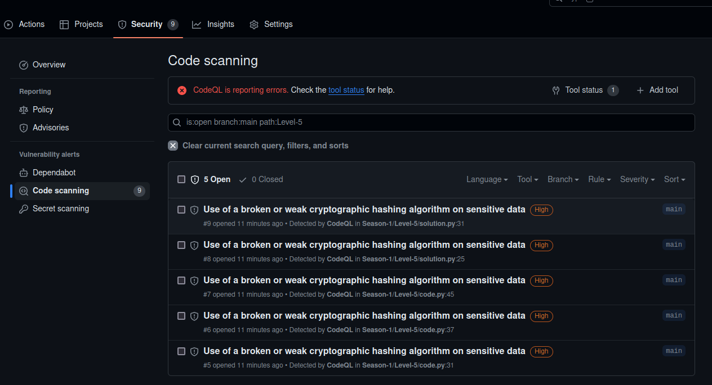
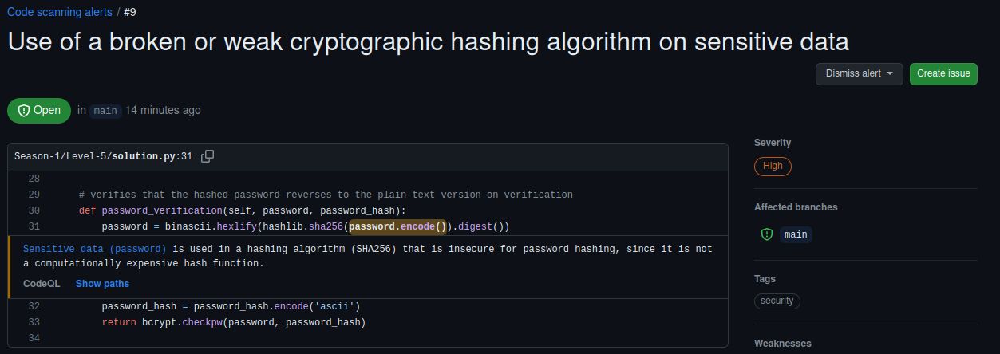
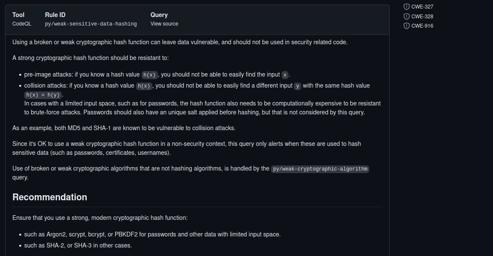
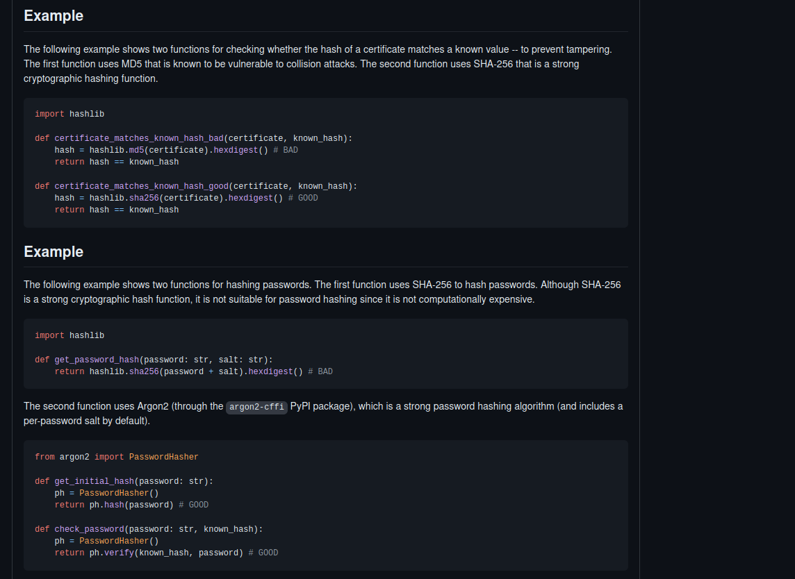
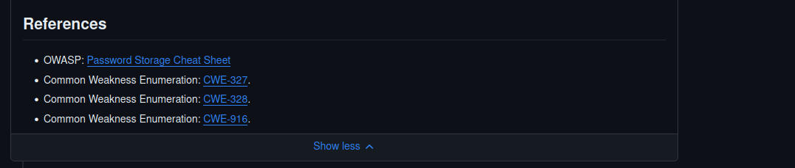

# secure-code-game

> This is my own README with a record of what I learned
>
> Original README is [here](./docs/README.md)

## Season-1

<details>

<summary>1. 【python】A Floating-point Underflow</summary>

>  浮動小数点アンダーフロー脆弱性

- float型を使う際は気をつけるべき点が増える
    - コンピュータの仕組み上、正確な少数を表現できないため
        ```python
        a = 1.1
        b = 2.2
        c = 3.3

        # 以下の演算はAssertionErrorとなる
        assert a + b == c
        ```
    - 大きい少数を用いると内部で近似が行われ、小さい少数が打ち消されてしまう
        ```python
        a = 1e19  # <- float
        b = 1000.00

        # 以下の演算はAssertionErrorとなる
        assert a + b == 10000000000000001000
        ```
- Pythonだと`decimal.Decimal`モジュールを使うと、正確な浮動小数点の計算が可能
    - `Decimal(str(***))`：代入する数値をstr型にするのが鉄則?
- また、プログラムの仕様に沿い／を定義し、適切な最大値と最小値の範囲検査を行うことが重要
    - 最大値、最小値はグローバル変数で定義する

</details>

<details>

<summary>2. 【c】Security through Obscurity Abuse / Buffer Overflow</summary>


- 隠蔽によるセキュリティでは、不十分なことが多く、他のセキュリティ対策と合わせて使用するべき
    - 問題では、攻撃者がバイナリからこれらの攻撃を可能とすることが伺える
- Buffer Overflowに関しては、やはり範囲チェックはしっかりやろうに帰着
    - 「想定する最低値から最大値の間の値になっているか」
- gdbでバイナリ検査してわかったこと
    - strtol()は、char*型で表現された数字をlong型整数値に変換する関数だが、マイナス値を入れるとバイナリ上で補数表現がされる
    - strtol()の演算結果をメモリのindex計算に用いると、マイナス値をうまく活用することで、想定外のメモリ番地へアクセス可能となる
        ```example
        // 本来なら`input_from_strtol = 0x2`等の小さな自然数が望まれる場面
        // 以下は、strtol('-6')のケース
        input_from_strtol = 0xFFFFFFFFFFFFFFFA

        /*
        本来なら、0x5500006 より高いアドレスへアクセスすることを想定しているが、
        補数表現で大きな値が入ると、x64環境で16桁しか保持されないので、
        演算結果が`0x10000000005500000`となり、切り捨てで`0x0000000005500000`=`0x5500000`
        つまり、想定した0x5500006より低いアドレスへのアクセスを許してしまう
        */
        EAX = 0x5500000
        struct[EAX + input_from_strtol + 0x6] = 1
        ```

</details>

<details>

<summary>3. 【python】Directory Traversal</summary>

- 今までの考えだと、ディレクトリトラバーサルにはサニタイズで対処するのかと思っていた。が、入力されたパスを一回演算して、アクセス先が想定されたパス配下を指しているかを比較するという手段がある
    ```python
    import os

    # アクセスが想定されるパス
    base_dir = os.path.dirname(os.path.abspath(__file__))

    inputPath = input("ユーザ／攻撃者が入力したパス:")

    # ここで入力されたパスを一度演算する
    realPath = os.path.realpath(inputPath)

    # 入力されたパスとアクセスが想定されるパスが同じディレクトリ上を指しているか検査する
    # ディレクトリトラバーサルがある場合、realPathは別のディレクトリを指す
    assert base_dir == os.path.commonprefix([base_dir, realPath])
    ```

</details>

<details>

<summary>4. 【python】SQL Injection</summary>

- SQL Injection対策にはplaceholderを使用する
    ```python
    query = "SELECT price FROM stocks WHERE symbol = ?"
    cur.execute(query, (value,))
    ```
- セキュリティの観点では、動的なクエリ生成はよろしくないので、上記のようなプリペアドステートメントを使用するべき
    - ユーザからクエリを受取、そのまま`executescript()`や`execute()`に流すのは危険
        - クエリではなく、パラメータを受け取るというのが重要

</details>

<details>

<summary>5. 【python】Weak Hash and Password</summary>

- ハッシュ値における衝突攻撃の懸念があるため、MD5ではなく、SHA-256などの強力なハッシュ関数を使うべき
- パスワードハッシュの話
    - SHA-256は計算コスト(ビット長256bit, 64文字分)が高くないため、パスワードハッシュで使用すると解読される懸念？
    - パスワードハッシュのベストプラクティスは[OWASP](https://cheatsheetseries.owasp.org/cheatsheets/Password_Storage_Cheat_Sheet.html#peppering)を参考にすると良い
    - パスワード保存の手段
        - saltを使う
        - pepperを使う：HMACを使う。パスワードハッシュ(本文)と共有鍵(Hardware Security Modulesにしまう)を元にもう一度ハッシュをかける。
        - WorkFactorを使う：各パスワードに対してハッシュを何回か反復する。
    - パスワードハッシュの手段
        - **Argon2id** <= 今回はこれをpythonライブラリで実装する
        - scrypt
        - etc...
- CodeQLの結果
    - セキュリティタブ
        
    - 詳細
        
        
        
        

</details>

## Season-2

<details>

<summary>1. 【github-action】Untrusted Third-party Github Action</summary>

- Github Marketplaceからサードパーティ製のGithub Actionを使用するのは便利だが、気をつけることも増える
    - (サードパーティ製のActionを通して)攻撃面が増える
    - プロジェクトの依存関係が増える
- サードパーティ製のActionを利用する際に気をつけること
    - 単純なタスクには用いない
    - 検証済みの作成者からのGitHubアクションを使用する
    - バージョンは最新を保つ(セキュリティ上の修正が入っている可能性があるため)
    - メンテナンスと更新を考慮する
    - 組織の設定でActionを無効化／制限することを検討する
    - Actionの追加には複数のレビュアで確認するプロセスを作る
- Github Tokenの権限を既存のワークフローを壊さない限りで、必要最低限のアクセス許可にする(読み取り・書き込み ⇒ 読み取りのみなど)。

</details>

<details>

<summary>2. 【golang】Sensitive Information Management</summary>

- logにアクセス可能な攻撃者にsecretを盗まれる可能性があるので、logにはsecretを流さない／暗号化等の適切な処理をする
    ```golang
    log.Printf("Invalid email format: %q", email)
    ```
- 割と気づかなそうなユーザ(Email)列挙が可能となってしまうようなケース
    - コード例）
        ```
        email := reqBody.Email
        password := reqBody.Password

        // ①
        // ここで入力ユーザ(Email)に対する保存パスワードがないだけで弾いてしまうと、
        // アプリ自体に登録されているユーザが見つかるまで、BruteForceで
        // パスワードの成否に関係なくユーザ(Email)の探索・列挙が可能となってしまう
        // (エラーメッセージの差異により)
        storedPassword, ok := testFakeMockUsers[email]
        if !ok {
            http.Error(w, "invalid email or password", http.StatusUnauthorized)
            return
        }

        // ②
        // ここだけで弾けば、既存ユーザの列挙をされずに済む
        if password == storedPassword {
            ...
		} else {
			http.Error(w, "Invalid Email or Password", http.StatusUnauthorized)
        }
        ```
    - 上のコード例では、①と②の時のエラーメッセージが違うことから攻撃者がユーザ列挙が可能であることを察すことができる。なので`solution.go`のようにエラーメッセージを統一するだけで、エラーメッセージの差異によるユーザ列挙が可能かの判別ができなくなる。

</details>

<details>

<summary>3. 【python】DOM based XSS</summary>

- 元のサニタイズの実装だと不十分
    - サニタイズ／正規表現が
        - `()`の文字をカバーしていない
        - `&lt`、`&gt`の特殊エンティティをカバーしていない
    - `display.html`内で
        - `safe`オプションにより自動エスケープがoffになってる
        - `safe`オプションのついた危険なテキストを再利用している
- 修正
    - jinjaの`{{ *** | safe }}`は自動エスケープのOFFという意味なので、ここで描画されるテキストをHTMLとして再利用しないように気をつける
    - 独自のエスケープを実装するのではなく、`markupsafe.escape()`を利用する
- 一般的なXSSの防御方法
    - ユーザーの入力を適切にサニタイズする
    - コンテンツセキュリティポリシー（CSP）を使用する
    - X-XSS-Protectionヘッダーを使用する
    - HttpOnlyクッキーを使用する <= ???
- DOM based XSS
    - DOM からテキストを読み取りHTML として使用すると、テキストのエスケープが効果的に解除されXSSにつながる可能性がある。
    - 対策の一つとしては、ページにテキストを書き込む前にエンコード/エスケープを使用することが挙げられる
    - また、DOMの再利用時にHTMLとして読み込まないことも対策として挙げられる
        ```javascript
        // Bad Practice
        var target = $(this).attr("data-target");
        $(target).hide();

        // Good Practice 
        // `$.find()`関数により、HTMLではなくCSSセレクタとして読み込んでいる
        var target = $(this).attr("data-target");
        $.find(target).hide();
        ```

</details>

<details>

<summary>4. 【nodejs】XXE</summary>

- xmlのパースは多くの場合ライブラリが用意されていると思うが、そのオプションは適切に設定する必要がある。今回で言えば`libxmljs.parseXml()`関数が該当する。
    - `replaceEntities: false`：XMLエンティティの置換オプションを無効にする。
    - `recover: false`：特定の解析エラーからの回復を無効にする。
    - `nonet: true`：解析時のネットワークアクセス(ファイルパスやURL)を無効にする。ここが有効だとカスタムエンティティで指定された任意のファイルが読み込まれたりする。
- この問題では、上記の話以外にも実装としてよくないプラクティスがあった
    - 任意のファイルタイプをアップロードできるファイルアップロード機能
    - `.admin`拡張子を持つファイルから、サーバー上でのコマンド実行を可能とする機能

</details>

<details>

<summary>5. 【javascript】Prototype Pollution</summary>


- Objectや`__proto__`、Arrayなどのプロパティを攻撃者が悪意のある関数等で上書きする攻撃
- なお、これらの攻撃の実行条件として以下がある
    - 再帰的なマージを実行する
    - パスに基づいてプロパティを定義する
    - オブジェクトをクローンする
- 対策
    - 入力の検証を行う(引数の型をチェックする等)
    - オブジェクトの不変性を宣言する(Object.freeze)
    - ローカル参照を作る
        - JavaScriptでは、メソッドがローカル->グローバルの順に検索されるため
        - 外部から干渉されないものを内部で使うという意図
    - 配列の明示的な初期化?
        - 空ではなく、使用する分の0で配列を初期化する等
            - Arrayのsetterが汚染されても発火しないようになる？

- 参考: [HackTricks](https://book.hacktricks.xyz/v/jp/pentesting-web/deserialization/nodejs-proto-prototype-pollution#javascriptniokerupurototaipu)

</details>
